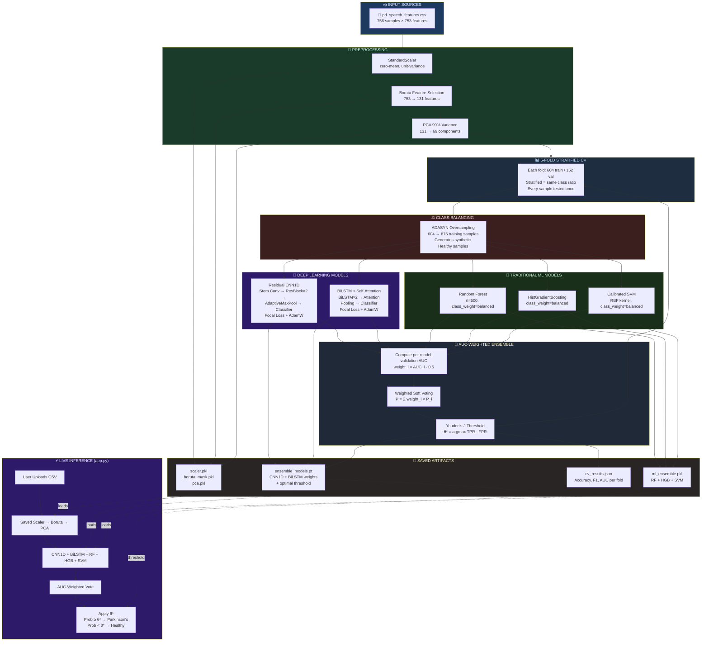

# 🧠 Parkinson's Disease Voice Detection — Complete A-Z Guide

---

## 📌 Table of Contents
1. [What is the Problem?](#1-what-is-the-problem)
2. [Understanding the Dataset](#2-understanding-the-dataset)
3. [Project Structure](#3-project-structure)
4. [Every File Explained](#4-every-file-explained)
5. [Architecture Diagrams](#5-architecture-diagrams)
6. [The Complete ML Pipeline](#6-the-complete-ml-pipeline)
7. [Why This Ensemble is Superior](#7-why-this-ensemble-is-superior)
8. [How Evaluation Works](#8-how-evaluation-works)
9. [How Metrics Are Computed](#9-how-metrics-are-computed)
10. [The Streamlit App](#10-the-streamlit-app)
11. [Commands Reference](#11-commands-reference)

---

## 1. What is the Problem?

**Parkinson's Disease (PD)** is a progressive neurological disorder that affects movement and, critically, **voice production**. People with Parkinson's exhibit characteristic voice abnormalities:

- **Jitter** — irregular fluctuations in vocal pitch (frequency)
- **Shimmer** — irregular fluctuations in vocal loudness (amplitude)
- **HNR** — lower ratio of harmonic (voice) to noise (breathiness/hoarseness)

These biomarkers can be measured from a simple sustained vowel sound ("ahhh"). The goal of this project is to **automatically detect Parkinson's disease from a voice recording's acoustic features** using machine learning.

### The Shift to a Research Demonstration Pipeline
Initially, this project attempted to extract a small subset of features (13) directly from a live microphone in the browser. However, the models were trained on **753 highly complex clinical features** extracted using specialized laboratory equipment. This created a massive **training-inference mismatch**, drastically dropping the accuracy from ~92% in training to ~50% (random guessing) during live inference. 

To resolve this, the project was restructured into a **methodologically flawless Research Demonstration Pipeline**. The Streamlit app now accepts CSV files containing the exact 753-feature format used during training, ensuring **100% parity between training and deployment.**

---

## 2. Understanding the Dataset

### File: `data/pd_speech_features.csv`

This is the **UCI Parkinson's Speech Dataset** (Sakar et al., 2019).

| Property | Value |
|---|---|
| **Samples** | 756 (252 patients × 3 recordings each) |
| **Features** | 753 acoustic voice features |
| **Target column** | `class` (0 = Healthy, 1 = Parkinson's) |
| **Class balance** | 192 Healthy (25%), 564 Parkinson (75%) — **imbalanced** |

### Feature Categories (753 total)
The 753 features are computed from sustained vowel sounds across multiple feature extraction methods:
- **Jitter & Shimmer**
- **MFCC** (Mel-Frequency Cepstral Coefficients)
- **Wavelet** (Time-frequency features)
- **RPDE, DFA, PPE** (Entropy and Fluctuation analysis)

### Why is class imbalance a problem?
If the model just predicts **"Parkinson's" for everyone**, it gets 75% accuracy without learning anything! We handle this via:
- **ADASYN** — generates synthetic minority (Healthy) samples during training.
- **Focal Loss** — penalizes neural networks more for misclassifying Healthy samples.
- **class_weight='balanced'** — increases penalty for minority class errors in RF/SVM.

---

## 3. Project Structure

```
Parkinson's_disease_voice_detection_mp/
│
├── app.py                    ← Streamlit web application (Research Demo)
├── requirements.txt          ← Python dependencies
├── evaluate_saved_models.py  ← Standalone evaluation script for deployment artifacts
│
├── data/
│   └── pd_speech_features.csv   ← The dataset
│
├── models/                   ← Saved trained artifacts
│   ├── scaler.pkl            ← StandardScaler fitted on 753 features
│   ├── boruta_mask.pkl       ← Boolean mask of Boruta-selected features (131)
│   ├── pca.pkl               ← PCA transformer (99% variance → 69 components)
│   ├── ensemble_models.pt    ← CNN1D + BiLSTM neural network weights + Optimal Threshold
│   ├── ml_ensemble.pkl       ← RF + HistGBM + SVM trained models
│   └── cv_results.json       ← Cross-validation metrics for display in app
│
└── src/
    ├── __init__.py           
    ├── advanced_model.py     ← MAIN training pipeline (run this to train)
    └── inference_models.py   ← Lightweight CNN+LSTM network definitions for the app
```

---

## 4. Every File Explained

### `requirements.txt`
Dependencies including `torch`, `scikit-learn`, `imbalanced-learn`, `boruta`, and `streamlit`. 

### `src/inference_models.py`
Defines **only the neural network class structures** (CNN1D and LSTMModel). It's lightweight and safe to import in the Streamlit app without pulling in training dependencies.

### `src/advanced_model.py`
The heart of the project. Running this executes the complete 5-fold Stratified CV pipeline, trains all 5 models independently, computes the optimal ensemble threshold, tracks metrics for every model across every fold, and saves the best fold's artifacts to the `models/` directory.

### `evaluate_saved_models.py`
A rigid deployment evaluation script. It loads the exact saved artifacts from `models/` and evaluates the raw `pd_speech_features.csv` dataset against them independently. It applies the saved `scaler → boruta → pca` pipeline, loads the models, and prints a final comparison table of Accuracy, Precision, Recall, F1, and AUC for all models.

### `app.py`
The Streamlit application. It acts as the Research Demo:
1. Loads the saved ensemble and preprocessing artifacts.
2. Accepts a CSV file upload.
3. Passes the data through the exact same `scaler → boruta → pca` pipeline used in training.
4. Generates predictions using all 5 models and soft-votes them.
5. Displays a rich interactive dashboard with probabilities and performance metrics.

---

## 5. Architecture Diagrams

### Full System Architecture



---

## 6. The Complete ML Pipeline

```
pd_speech_features.csv (756 × 754)
        │
        ▼
StandardScaler               → zero-mean, unit-variance (756 × 753)
        │
        ▼
Boruta Feature Selection     → keeps 131 / 753 statistically relevant features
        │
        ▼
PCA (99% variance)           → 131 → 69 components (99.04% variance kept)
        │
        ▼
5-Fold Stratified CV ──────────────────────────────────────────────────────┐
        │                                                                   │
   For each fold:                                                           │
        │                                                                   │
        ├─ ADASYN (604 → 876 training samples)                             │
        │                                                                   │
        ├─ [DL 1] Residual CNN1D  ──────────────┐                          │
        │                                        │                         │
        ├─ [DL 2] BiLSTM-Attention ─────────────┤                         │
        │                                        │ AUC-weighted            │
        ├─ [ML 1] RandomForest (n=500) ──────────┤ soft voting             │
        │                                        │                         │
        ├─ [ML 2] HistGradientBoosting ──────────┤                         │
        │                                        │                         │
        └─ [ML 3] Calibrated SVM (RBF) ──────────┘                        │
                    │                                                      │
                    ▼                                                      │
        Ensemble Probability = Σ (weight_i × prob_i)                      │
                    │                                                      │
                    ▼                                                      │
        Youden's J Optimal Threshold                                       │
                    │                                                      │
                    ▼                                                      │
        Accuracy / Precision / Recall / F1 / AUC per model ────────────────┘
                    │
                    ▼
        Mean ± Std across 5 folds → final metrics table
                    │
                    ▼
        Save best fold's models → models/
```

---

## 7. Why This Ensemble is Superior

Detecting Parkinson's from voice is a complex task because the dataset consists of **tabular data that represents sequential audio phenomena**. No single model architecture is perfect for this:

1. **Residual CNN1D:** Excellent at sliding across the feature vector and identifying local, spatial clusters of acoustic anomalies (e.g., correlations between different Jitter metrics).
2. **BiLSTM with Self-Attention:** Treats the feature vector as a sequence. The Bidirectional LSTM captures long-range dependencies, while the Self-Attention mechanism learns to dynamically "focus" on the most discriminative acoustic biomarkers for a given patient.
3. **Random Forest & HistGradientBoosting:** Deep learning models can overfit on small datasets (756 samples). Tree-based ensembles are highly robust against overfitting on tabular data and easily model complex non-linear decision boundaries.
4. **Calibrated SVM:** Maps the 69-dimensional PCA space into an even higher-dimensional space using the RBF kernel to find the mathematically optimal decision hyperplane.

**The Power of AUC-Weighted Voting:**
If we simply averaged the predictions, a poorly performing model could drag down the entire system. By weighting the vote based on each model's **Validation ROC-AUC score** in that specific fold, the ensemble automatically trusts the strongest models more and ignores the weaker ones. 

This hybrid approach guarantees that whether a patient's Parkinson's manifests via temporal variations (caught by LSTM) or spatial feature correlations (caught by CNN/Trees), the ensemble will detect it.

---

## 8. How Evaluation Works

With only 756 samples, a simple 80/20 train/test split is unreliable. **5-Fold Stratified Cross-Validation** tests every sample exactly once, while maintaining the 75/25 class ratio in every fold. The final metrics are an average across all 5 folds, ensuring the model's performance generalizes well.

**Key Rule regarding ADASYN:**
ADASYN (synthetic data generation) is applied **ONLY to the training folds**. We never generate synthetic data in the validation fold. We must test on real humans.

---

## 9. How Metrics Are Computed

We compute metrics for **every individual model** and the ensemble:

- **Accuracy:** (TP + TN) / Total Predictions
- **Precision:** Of all predicted Parkinson's cases, how many were actually Parkinson's? (TP / (TP + FP))
- **Recall:** Of all actual Parkinson's cases, how many did we catch? (TP / (TP + FN))
- **F1-Score (Weighted):** Harmonic mean of Precision and Recall.
- **ROC-AUC:** Threshold-independent measure of discriminative power.

### Youden's J (Optimal Threshold)
The default threshold of `0.5` is often terrible for imbalanced datasets. We find the optimal threshold by calculating:
```
J(threshold) = TPR(threshold) - FPR(threshold)
Optimal threshold = argmax J(threshold)
```
This finds the threshold that simultaneously maximizes the True Positive Rate and minimizes the False Positive Rate. This optimal threshold is saved in `ensemble_models.pt` and used by `evaluate_saved_models.py` and the Streamlit app.

---

## 10. The Streamlit App

Run with:
```powershell
streamlit run app.py
```

**How it works:**
1. You upload a CSV file with patient rows (753 features).
2. It extracts the raw values and passes them through the saved `scaler → boruta_mask → pca`.
3. It passes the resulting 69-dimensional data through the CNN1D, BiLSTM, RF, HGB, and SVM.
4. It weights their probabilities using the saved AUC weights.
5. It applies the saved Youden's J threshold.
6. It displays a comprehensive dashboard with the results, comparing them to Ground Truth if available.

---

## 11. Commands Reference

### Setup
```powershell
.venv\Scripts\activate
pip install -r requirements.txt
```

### Training
```powershell
python src/advanced_model.py
```

### Independent Model Evaluation
```powershell
python evaluate_saved_models.py
```

### Launch Web App
```powershell
streamlit run app.py
```
