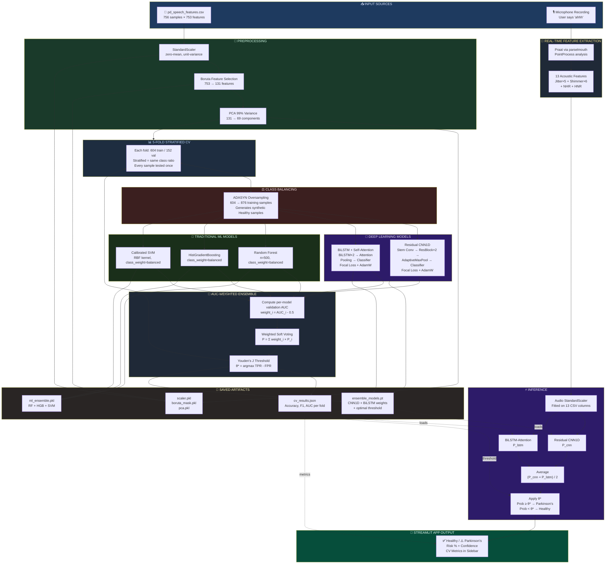
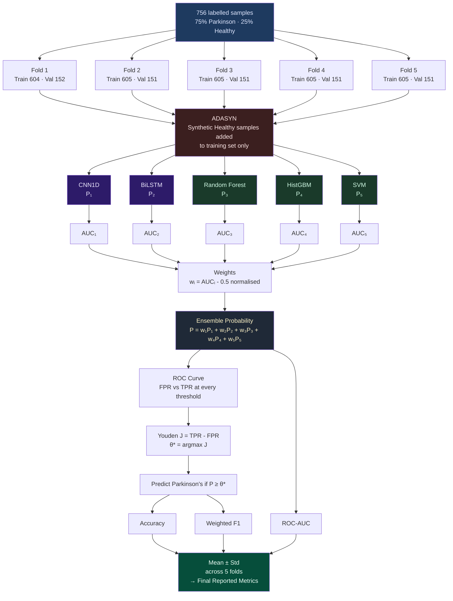

# 🧠 Parkinson's Disease Voice Detection — Complete A-Z Guide

---

## 📌 Table of Contents
1. [What is the Problem?](#1-what-is-the-problem)
2. [Understanding the Dataset](#2-understanding-the-dataset)
3. [Project Structure](#3-project-structure)
4. [Every File Explained](#4-every-file-explained)
5. [Architecture Diagrams](#5-architecture-diagrams)
6. [The Complete ML Pipeline](#6-the-complete-ml-pipeline)
7. [How Evaluation Works](#7-how-evaluation-works)
8. [How Metrics Are Computed](#8-how-metrics-are-computed)
9. [The Streamlit App](#9-the-streamlit-app)
10. [Commands Reference](#10-commands-reference)
11. [End-to-End Flow Diagram](#11-end-to-end-flow-diagram)

---

## 1. What is the Problem?

**Parkinson's Disease (PD)** is a progressive neurological disorder that affects movement and, critically, **voice production**. People with Parkinson's exhibit characteristic voice abnormalities:

- **Jitter** — irregular fluctuations in vocal pitch (frequency)
- **Shimmer** — irregular fluctuations in vocal loudness (amplitude)
- **HNR** — lower ratio of harmonic (voice) to noise (breathiness/hoarseness)

These biomarkers can be measured from a simple sustained vowel sound ("ahhh"). The goal of this project is to **automatically detect Parkinson's disease from a voice recording** using machine learning.

### Why voice?
- **Non-invasive** — just speak into a microphone
- **Accessible** — no hospital equipment needed
- **Early indicator** — voice changes appear early in PD progression

---

## 2. Understanding the Dataset

### File: `data/pd_speech_features.csv`

This is the **UCI Parkinson's Speech Dataset** (Sakar et al., 2019).

| Property | Value |
|---|---|
| **Samples** | 756 (252 patients × 3 recordings each) |
| **Features** | 753 acoustic voice features |
| **Target column** | `class` (0 = Healthy, 1 = Parkinson's) |
| **Class balance** | 192 Healthy (25%), 564 Parkinson (75%) — **imbalanced** |

### CSV structure
```
Row 1: dataset description/header info (skipped with header=1)
Row 2: column names → id, feature1, feature2, ..., feature753, class
Row 3+: actual data
```

### Feature Categories (753 total)
The 753 features are computed from sustained vowel sounds across multiple feature extraction methods:

| Feature Group | Description | Count |
|---|---|---|
| **Jitter** | Pitch cycle-to-cycle variations | ~5 |
| **Shimmer** | Amplitude cycle-to-cycle variations | ~6 |
| **HNR / NHR** | Harmonic-to-noise ratio | ~2 |
| **MFCC** | Mel-Frequency Cepstral Coefficients (vocal tract shape) | ~many |
| **Wavelet** | Time-frequency features | ~many |
| **RPDE** | Recurrence Period Density Entropy | ~few |
| **DFA** | Detrended Fluctuation Analysis | ~few |
| **PPE** | Pitch Period Entropy | ~few |

### Why is class imbalance a problem?
If the model just predicts **"Parkinson's" for everyone**, it gets 75% accuracy without learning anything! We need special techniques to handle this:
- **ADASYN** — generates synthetic minority (Healthy) samples during training
- **Focal Loss** — penalizes the model more for misclassifying Healthy samples
- **class_weight='balanced'** — in RF/SVM, increases penalty for minority class errors

---

## 3. Project Structure

```
Parkinson's_disease_voice_detection_mp/
│
├── app.py                    ← Streamlit web application (main entry point)
├── dataprep.py               ← Exploratory data preparation script
├── requirements.txt          ← Python dependencies
├── .gitignore                ← Files excluded from git
│
├── data/
│   └── pd_speech_features.csv   ← ONLY dataset used for training
│
├── models/                   ← Saved trained artifacts (generated by training)
│   ├── scaler.pkl            ← StandardScaler fitted on all 753 features
│   ├── boruta_mask.pkl       ← Boolean mask of Boruta-selected features
│   ├── pca.pkl               ← PCA transformer (99% variance)
│   ├── ensemble_models.pt    ← CNN1D + BiLSTM neural network weights
│   ├── ml_ensemble.pkl       ← RF + HistGBM + SVM trained models
│   └── cv_results.json       ← Cross-validation metrics for display in app
│
└── src/
    ├── __init__.py           ← Makes src/ a Python package
    ├── advanced_model.py     ← MAIN training pipeline (run this to train)
    ├── inference_models.py   ← Lightweight CNN+LSTM for app inference
    ├── audio_prepro.py       ← Real-time audio feature extraction
    ├── extract_features.py   ← Alternative feature extractor (unused)
    └── model.py              ← Legacy basic Random Forest (historical only)
```

---

## 4. Every File Explained

---

### `requirements.txt`
Lists all Python packages needed:

```
pandas>=1.5           → data manipulation (DataFrames)
scikit-learn>=1.2     → ML models, scaling, PCA, metrics
imbalanced-learn>=0.10 → ADASYN oversampling
joblib>=1.2           → saving/loading sklearn models
boruta>=0.4           → Boruta feature selection
torch>=2.12           → CNN1D + BiLSTM neural networks
praat-parselmouth>=0.4.3 → acoustic feature extraction from audio
soundfile>=0.12       → reading audio files
librosa>=0.11         → audio processing utilities
streamlit-audiorec    → microphone recording widget in Streamlit
numpy>=2.0            → numerical computing
```

**Install all with:**
```powershell
pip install -r requirements.txt
```

---

### `src/audio_prepro.py` — Real-time Audio Feature Extractor

This file is used **at inference time** when the user records their voice in the app.

**What it does:**
1. Loads the `.wav` audio file using `parselmouth` (Python wrapper for Praat — the gold-standard acoustic analysis tool)
2. Extracts a **PointProcess** (sequence of vocal fold closure moments)
3. Computes 13 acoustic features from that PointProcess:

```python
# JITTER (5 features) — pitch irregularity
jitter_local    = % variation between consecutive pitch periods
jitter_abs      = absolute variation in pitch periods (seconds)
jitter_rap      = relative average perturbation (3-period window)
jitter_ppq5     = pitch perturbation quotient (5-period window)
jitter_ddp      = average absolute difference of differences

# SHIMMER (6 features) — amplitude irregularity
shimmer_local   = % amplitude variation between consecutive cycles
shimmer_db      = amplitude variation in decibels
shimmer_apq3    = amplitude perturbation quotient (3-cycle window)
shimmer_apq5    = amplitude perturbation quotient (5-cycle window)
shimmer_apq11   = amplitude perturbation quotient (11-cycle window)
shimmer_dda     = difference of differences of amplitude

# NOISE (2 features)
nhr             = Noise-to-Harmonic Ratio (higher = more noise)
hnr             = Harmonic-to-Noise Ratio (higher = cleaner voice)
```

**Output:** A numpy array of shape `(13,)`

**Why 13 features vs 753 in the CSV?**
The CSV has 753 features computed in a research lab with specialized equipment. Real-time extraction from a browser microphone can only reliably compute the 13 core acoustic features. The models handle this because both CNN1D and BiLSTM use dimension-agnostic architectures (AdaptiveMaxPool / sequence length flexibility).

---

### `src/inference_models.py` — Lightweight Model Architectures

This file defines **only the neural network class structures** — no training imports. It's safe to import in the Streamlit app without pulling in `boruta`, `ADASYN`, or other heavy training dependencies.

#### `CNN1D` — Residual 1D Convolutional Network

```
Input: (batch, 1, 13)  ← 13 audio features as a 1D sequence
  ↓
Stem Conv (1→64 channels, kernel=5)
  ↓
ResBlock 1 (64 channels):  Conv→BN→ReLU→Dropout→Conv→BN + skip connection
  ↓
Downsample (64→128 channels)
  ↓
ResBlock 2 (128 channels):  same structure
  ↓
AdaptiveMaxPool1d(1) ← collapses any sequence length to 1
  ↓
Linear(128→64)→ReLU→Dropout→Linear(64→1)→Sigmoid
Output: (batch,) probability of Parkinson's
```

**Why residual blocks?** Skip connections (`x + block(x)`) prevent vanishing gradients, allowing deeper networks to train effectively. The signal can bypass layers that aren't learning anything useful.

**Why AdaptiveMaxPool1d(1)?** This reduces any sequence length (13 features, 41 PCA components, 69 PCA components) to a single value — making the model **dimension-agnostic**. Trained on 69 features, runs inference on 13 features. ✅

#### `LSTMModel` — Bidirectional LSTM with Self-Attention

```
Input: (batch, 13, 1)  ← 13 features treated as 13 time steps
  ↓
BiLSTM Layer 1 (input=1, hidden=64, bidirectional) → output: (batch, 13, 128)
  ↓ Dropout
BiLSTM Layer 2 (input=128, hidden=64, bidirectional) → output: (batch, 13, 128)
  ↓ Dropout
Self-Attention: score each timestep, weighted sum → (batch, 128)
  ↓
Linear(128→64)→ReLU→Dropout→Linear(64→1)→Sigmoid
Output: (batch,) probability of Parkinson's
```

**Why bidirectional?** Reads the feature sequence both forward AND backward, capturing dependencies from both directions.

**Why self-attention?** Not all 13 features are equally important. Attention learns to assign higher weight to the most discriminative features dynamically.

---

### `src/advanced_model.py` — The Main Training Pipeline

This is the heart of the project. Running `python src/advanced_model.py` executes the complete pipeline and saves all model artifacts.

#### Step-by-step walkthrough:

**Step 1: Load Data**
```python
df = pd.read_csv('data/pd_speech_features.csv', header=1)
X = df.drop(columns=['id', 'class'])   # 753 features
y = df['class'].values                  # 0 or 1 labels
```

**Step 2: StandardScaler**
```python
scaler = StandardScaler()
X_scaled = scaler.fit_transform(X)
```
Centers each feature to mean=0 and scales to std=1. Critical because:
- Features have wildly different ranges (e.g., HNR ~20, Jitter ~0.002)
- Distance-based algorithms (SVM) and gradient descent (neural nets) assume similar scales

**Step 3: Boruta Feature Selection (131 of 753 features)**

Boruta is a wrapper around Random Forest that identifies **statistically relevant features**:
1. Creates "shadow" copies of each feature with randomly shuffled values
2. Trains RF on real + shadow features
3. Features that consistently beat their shadow counterparts are selected
4. Reduces 753 → 131 features, removing noise

```python
rf_b = RandomForestClassifier(n_estimators=100, max_depth=7)
boruta = BorutaPy(estimator=rf_b, n_estimators='auto', max_iter=100)
boruta.fit(X_scaled, y)
mask = boruta.support_   # boolean mask of selected features
X_selected = X_scaled[:, mask]  # 131 features
```

**Step 4: PCA (99% variance → 69 components)**

PCA (Principal Component Analysis) reduces the 131 Boruta-selected features to 69 principal components while retaining 99.04% of the information.

```python
pca = PCA(n_components=0.99)   # keep components until 99% variance explained
X_reduced = pca.fit_transform(X_selected)  # 131 → 69
```

Why PCA after Boruta?
- Removes remaining collinearity (correlated features)
- Reduces input dimensionality for neural networks
- 99% variance means we lose only 1% of information

**Step 5: 5-Fold Stratified Cross-Validation**

This is how we get trustworthy accuracy estimates. See Section 6 for detailed explanation.

**Step 6: Per-fold training of 5 models:**

*(a) ADASYN Balancing*
```python
adasyn = ADASYN(n_neighbors=5)
X_balanced, y_balanced = adasyn.fit_resample(X_train, y_train)
# 604 → 876 samples (generates synthetic Healthy samples)
```

*(b) Train Residual CNN1D with Focal Loss*
*(c) Train BiLSTM-Attention with Focal Loss*
*(d) Train RandomForest(n=500, class_weight='balanced')*
*(e) Train HistGradientBoosting(class_weight='balanced')*
*(f) Train Calibrated SVM (RBF kernel)*

**Step 7: AUC-weighted ensemble**
```python
# Compute each model's validation AUC
aucs = [auc_cnn, auc_lstm, auc_rf, auc_hgb, auc_svm]

# Weight proportional to AUC (better models get more say)
weights = np.clip(aucs, 0.5, 1.0) - 0.5  # subtract 0.5 (random baseline)
weights = weights / weights.sum()

# Weighted average of all 5 probabilities
y_prob = sum(w_i * p_i for w_i, p_i in zip(weights, probas))
```

**Step 8: Optimal Threshold (Youden's J)**
```python
fpr, tpr, thresholds = roc_curve(y_val, y_prob)
j_scores = tpr - fpr
optimal_threshold = thresholds[argmax(j_scores)]
# predict Parkinson's if prob >= optimal_threshold
```

The default threshold of 0.5 is rarely optimal for imbalanced datasets. This finds the threshold that **maximizes TPR - FPR simultaneously**.

**Step 9: Save all artifacts to `models/`**

---

### `src/model.py` — Legacy Basic Random Forest (Historical)

This was the first, simple version of the model. It:
- Loaded `pd_speech_features.csv`
- Trained a basic RandomForestClassifier (no CV, no balancing)
- Saved `parkinsons_rf_model.pkl` and `scaler.pkl` to root

**This file is NOT used by the app.** It's kept for historical reference only. The current pipeline is entirely in `advanced_model.py`.

---

### `app.py` — The Streamlit Web Application

This is the user-facing application. Run with:
```powershell
streamlit run app.py
```

**What it does on startup:**
1. Loads `models/ensemble_models.pt` → CNN1D + BiLSTM weights + optimal threshold
2. Builds an audio StandardScaler from the 13 matching CSV columns
3. Loads `models/cv_results.json` → shows metrics in sidebar

**What it does when user records:**
1. `st_audiorec()` captures microphone audio as bytes
2. Audio bytes → temp `.wav` file
3. `extract_features(wav_path)` → 13 acoustic features (numpy array)
4. Scale features with audio scaler
5. Run CNN1D and BiLSTM → two probability scores
6. Average them → ensemble probability
7. Apply optimal threshold → binary prediction
8. Show result (Healthy/Parkinson's), risk %, breakdown

---

### `dataprep.py` — Exploratory Script

A small helper that downloads/prepares data. Not part of the main pipeline.

---

## 5. Architecture Diagrams

### 5.1 Full System Architecture

This diagram shows the complete system: how data flows from the CSV through feature engineering into the hybrid ensemble during training, and how a live microphone recording flows through the deep learning models during inference.



---

### 5.2 Neural Network Architecture Detail

This diagram shows the internal layer-by-layer structure of both deep learning models.

```mermaid
flowchart LR
    subgraph CNN1D_ARCH[" Residual CNN1D "]
        direction TB
        A1["Input\n(batch, 1, N)\nN = features"]
        A2["Stem Conv1d\n1→64 ch, kernel=5\nBatchNorm + ReLU + Dropout"]
        A3["ResBlock 1\nConv→BN→ReLU→Drop→Conv→BN\n+ skip: x + block x\n64 channels"]
        A4["Downsample\nConv 64→128 ch, kernel=3\nBatchNorm + ReLU + Dropout"]
        A5["ResBlock 2\nConv→BN→ReLU→Drop→Conv→BN\n+ skip: x + block x\n128 channels"]
        A6["AdaptiveMaxPool1d 1\n→ batch × 128\nDimension-Agnostic"]
        A7["Classifier Head\nLinear 128→64\nReLU + Dropout 0.4\nLinear 64→1\nSigmoid"]
        A8["Output\nP Parkinsons\n0 to 1"]
        A1-->A2-->A3-->A4-->A5-->A6-->A7-->A8
    end

    subgraph BILSTM_ARCH[" BiLSTM + Self-Attention "]
        direction TB
        B1["Input\n(batch, N, 1)\nN features as N timesteps"]
        B2["BiLSTM Layer 1\ninput=1, hidden=64\nbidirectional → output 128\nbatch × N × 128"]
        B3["Dropout 0.3"]
        B4["BiLSTM Layer 2\ninput=128, hidden=64\nbidirectional → output 128\nbatch × N × 128"]
        B5["Dropout 0.3"]
        B6["Self-Attention\nScore = Linear 128→1\nWeights = Softmax over N\nContext = Σ weight_t × h_t\nbatch × 128"]
        B7["Classifier Head\nLinear 128→64\nReLU + Dropout 0.4\nLinear 64→1\nSigmoid"]
        B8["Output\nP Parkinsons\n0 to 1"]
        B1-->B2-->B3-->B4-->B5-->B6-->B7-->B8
    end

    subgraph FOCAL[" Focal Loss Training "]
        direction TB
        F1["FL p = -α × 1-p ^γ × log p"]
        F2["α = 0.75  γ = 2.0"]
        F3["Easy examples: p≈1\n1-p ^2 ≈ 0 → small loss"]
        F4["Hard examples: p≈0\n1-p ^2 ≈ 1 → full loss"]
        F1---F2---F3---F4
    end

    style CNN1D_ARCH fill:#2d1b69,color:#ede9fe
    style BILSTM_ARCH fill:#1a3a5a,color:#bfdbfe
    style FOCAL fill:#3b1f1f,color:#fde8e8
```



---

### 5.3 Cross-Validation & Ensemble Decision Flow



---

## 6. The Complete ML Pipeline

```
pd_speech_features.csv (756 × 754)
        │
        ▼
StandardScaler               → zero-mean, unit-variance (756 × 753)
        │
        ▼
Boruta Feature Selection     → keeps 131 / 753 statistically relevant features
        │
        ▼
PCA (99% variance)           → 131 → 69 components (99.04% variance kept)
        │
        ▼
5-Fold Stratified CV ──────────────────────────────────────────────────────┐
        │                                                                   │
   For each fold:                                                           │
        │                                                                   │
        ├─ ADASYN (604 → 876 training samples)                             │
        │                                                                   │
        ├─ [DL 1] Residual CNN1D  ──────────────┐                          │
        │   Focal Loss + AdamW + CosineAnnealing │                         │
        │   PATIENCE=25, EPOCHS=200              │                         │
        │                                        │                         │
        ├─ [DL 2] BiLSTM-Attention ─────────────┤                         │
        │   Focal Loss + AdamW + CosineAnnealing │                         │
        │                                        │ AUC-weighted            │
        ├─ [ML 1] RandomForest (n=500) ──────────┤ soft voting             │
        │   class_weight='balanced'              │                         │
        │                                        │                         │
        ├─ [ML 2] HistGradientBoosting ──────────┤                         │
        │   class_weight='balanced'              │                         │
        │                                        │                         │
        └─ [ML 3] Calibrated SVM (RBF) ──────────┘                        │
            class_weight='balanced'                                        │
                    │                                                      │
                    ▼                                                      │
        Ensemble Probability = Σ (weight_i × prob_i)                      │
                    │                                                      │
                    ▼                                                      │
        Youden's J Optimal Threshold                                       │
                    │                                                      │
                    ▼                                                      │
        Accuracy / F1 / AUC per fold ──────────────────────────────────────┘
                    │
                    ▼
        Mean ± Std across 5 folds → final metrics
                    │
                    ▼
        Save best fold's models → models/
```

---

## 6. How Evaluation Works

### Why Cross-Validation instead of a simple train/test split?

With only 756 samples, a single 80/20 split (604 train, 152 test) gives unreliable metrics — the result depends heavily on **which 152 samples happen to be in the test set**.

**5-Fold Stratified Cross-Validation** solves this:

```
All 756 samples
│
├─ Fold 1: Train on folds 2+3+4+5 (604) → Test on fold 1 (152)
├─ Fold 2: Train on folds 1+3+4+5 (605) → Test on fold 2 (151)
├─ Fold 3: Train on folds 1+2+4+5 (605) → Test on fold 3 (151)
├─ Fold 4: Train on folds 1+2+3+5 (605) → Test on fold 4 (151)
└─ Fold 5: Train on folds 1+2+3+4 (605) → Test on fold 5 (151)
```

**Stratified** means each fold maintains the same class ratio (25% Healthy, 75% Parkinson) as the full dataset — preventing any fold from being all-Parkinson or all-Healthy.

**Result:** Every sample is tested exactly once. The final metric is the average across all 5 folds, with the standard deviation telling us how stable the model is.

### Key rule: ADASYN is applied ONLY to training data, NEVER to test data

```python
for fold in folds:
    X_train, X_test = ...
    X_train_balanced, y_train_balanced = ADASYN().fit_resample(X_train, y_train)
    # ↑ synthetic samples only in training
    # X_test remains the original real samples
    model.train(X_train_balanced, y_train_balanced)
    predictions = model.predict(X_test)   # real samples only
```

This is critical — if we added synthetic samples to the test set, we'd be measuring accuracy on fake data.

---

## 7. How Metrics Are Computed

### Accuracy
```
Accuracy = (Correct predictions) / (Total predictions)
         = (TP + TN) / (TP + TN + FP + FN)
```
Where:
- **TP** = True Positives (correctly predicted Parkinson's)
- **TN** = True Negatives (correctly predicted Healthy)
- **FP** = False Positives (predicted Parkinson's but actually Healthy)
- **FN** = False Negatives (predicted Healthy but actually Parkinson's — most dangerous!)

### F1-Score (Weighted)
```
Precision = TP / (TP + FP)    ← of all Parkinson's predictions, how many were right?
Recall    = TP / (TP + FN)    ← of all actual Parkinson's cases, how many did we catch?

F1 = 2 × (Precision × Recall) / (Precision + Recall)
```
Weighted F1 accounts for class imbalance by weighting each class's F1 by its support (count).

### ROC-AUC (Area Under the ROC Curve)
- The ROC curve plots **TPR (sensitivity)** vs **FPR (1-specificity)** at every threshold
- AUC = area under that curve
- AUC = 1.0 → perfect model
- AUC = 0.5 → random guessing
- AUC = 0.95 → 95% chance the model ranks a random Parkinson's sample higher than a random Healthy sample

AUC is **threshold-independent** — it measures the model's discriminative power regardless of where you draw the decision line.

### Youden's J (Optimal Threshold)
```
J(threshold) = TPR(threshold) - FPR(threshold)

Optimal threshold = argmax J(threshold)
```
This finds the threshold that simultaneously maximizes true positive rate AND minimizes false positive rate.

### Code implementation:
```python
from sklearn.metrics import accuracy_score, f1_score, roc_auc_score, roc_curve

# After getting ensemble probabilities y_prob for validation set:
fpr, tpr, thresholds = roc_curve(y_val, y_prob)
optimal_threshold = thresholds[np.argmax(tpr - fpr)]

y_pred = (y_prob >= optimal_threshold).astype(int)

acc = accuracy_score(y_val, y_pred)           # e.g., 0.9277
f1  = f1_score(y_val, y_pred, average='weighted')  # e.g., 0.9241
auc = roc_auc_score(y_val, y_prob)            # e.g., 0.9670
```

### Focal Loss — the training loss function

```
FL(p) = -α × (1 - p)^γ × log(p)
```
Where:
- `p` = predicted probability for the true class
- `α = 0.75` — upweights positive (Parkinson's) class
- `γ = 2.0` — down-weights easy examples (if already p=0.9, loss ≈ 0)

When p is close to 1 (easy, well-classified example): `(1-p)^2 ≈ 0` → very small loss
When p is close to 0 (hard, misclassified example): `(1-p)^2 ≈ 1` → full loss

This makes the model **focus on hard-to-classify Healthy samples** (the minority class).

### Why CNN AUC can differ from ensemble AUC in the app

The app inference uses **only CNN1D + BiLSTM** on 13 audio features.
The CV metrics include **all 5 models** (CNN + LSTM + RF + HGB + SVM) on 69 PCA features.

The RF/HGB/SVM need all 753 → 131 Boruta → 69 PCA features from the CSV. They cannot process raw audio from a microphone (which only gives 13 features). So the app inference is deep-learning only, while the reported CV metrics reflect the full hybrid ensemble.

---

## 8. The Streamlit App

### How the app works end-to-end:

```
Browser microphone recording
        │
        ▼
st_audiorec() → audio bytes (WAV format)
        │
        ▼
Write to temp .wav file
        │
        ▼
src/audio_prepro.py → extract_features()
        │  (Praat acoustic analysis)
        ▼
13 features: [jitter×5, shimmer×6, NHR, HNR]
        │
        ▼
StandardScaler.transform()   ← scaler fitted on CSV columns
        │
        ▼
X_tensor shape: (1, 13)
        │
        ├──→ CNN1D(X.unsqueeze(1))   → p_cnn  (probability 0-1)
        │
        └──→ BiLSTM(X.unsqueeze(2)) → p_lstm (probability 0-1)
                    │
                    ▼
        ensemble_prob = (p_cnn + p_lstm) / 2
                    │
                    ▼
        if prob >= optimal_threshold:
            prediction = "Parkinson's Detected"
        else:
            prediction = "No Parkinson's Indicators"
```

### Sidebar shows:
- CV metrics from `models/cv_results.json` (Accuracy, F1, AUC per fold)
- Model description (Hybrid Ensemble v2)
- Ensemble loaded status + input_dim

### Why is the Streamlit server on port 8502 (not 8501)?
If port 8501 is already in use (e.g., another Streamlit instance), Streamlit automatically uses 8502. Kill the other instance or use `--server.port 8503` to force a specific port.

---

## 9. Commands Reference

### Setup
```powershell
# Install dependencies
pip install -r requirements.txt

# Verify key libraries
python -c "import torch, sklearn, streamlit; print('All OK')"
```

### Training
```powershell
# Run the full training pipeline (~15-20 min)
python src/advanced_model.py

# What it produces:
# models/scaler.pkl          ← StandardScaler
# models/boruta_mask.pkl     ← 131-feature boolean mask
# models/pca.pkl             ← PCA (99% variance)
# models/ensemble_models.pt  ← CNN1D + BiLSTM weights + optimal threshold
# models/ml_ensemble.pkl     ← RF + HistGBM + SVM
# models/cv_results.json     ← accuracy, F1, AUC per fold + mean/std
```

### Running the App
```powershell
# Start Streamlit (opens browser automatically)
streamlit run app.py

# Force a specific port
streamlit run app.py --server.port 8503
```

### Git / GitHub
```powershell
# Check status
git status

# Stage, commit, push
git add -A
git commit -m "your message"
git push origin main

# Check current branch
git branch

# View commit history
git log --oneline -5
```

### Cleanup
```powershell
# Remove legacy root-level model files
Remove-Item parkinsons_rf_model.pkl, scaler.pkl
```

---

## 10. End-to-End Flow Diagram

```
┌─────────────────────────────────────────────────────────────────────────────┐
│                          TRAINING PHASE                                     │
│                    (python src/advanced_model.py)                           │
│                                                                             │
│  data/pd_speech_features.csv                                                │
│         │ 756 samples × 753 features                                        │
│         ▼                                                                   │
│  StandardScaler ──────────────────────────────→ models/scaler.pkl          │
│         │                                                                   │
│         ▼                                                                   │
│  Boruta (131 features) ────────────────────────→ models/boruta_mask.pkl    │
│         │                                                                   │
│         ▼                                                                   │
│  PCA (99% var → 69 dims) ──────────────────────→ models/pca.pkl            │
│         │                                                                   │
│         ▼                                                                   │
│  5-Fold CV:                                                                 │
│    ADASYN → Residual CNN1D ─────────────────────┐                          │
│    ADASYN → BiLSTM-Attention ───────────────────┤ AUC-weighted             │
│    ADASYN → RandomForest(500) ──────────────────┤ ensemble +               │
│    ADASYN → HistGradientBoosting ───────────────┤ Youden's J               │
│    ADASYN → Calibrated SVM ─────────────────────┘ threshold                │
│         │                                                                   │
│         ▼                                                                   │
│  Best fold models saved:                                                    │
│    models/ensemble_models.pt  (CNN1D + BiLSTM + threshold)                 │
│    models/ml_ensemble.pkl     (RF + HGB + SVM)                             │
│    models/cv_results.json     (metrics)                                     │
└─────────────────────────────────────────────────────────────────────────────┘

┌─────────────────────────────────────────────────────────────────────────────┐
│                         INFERENCE PHASE                                     │
│                       (streamlit run app.py)                                │
│                                                                             │
│  User records "ahhh" in browser microphone                                 │
│         │                                                                   │
│         ▼                                                                   │
│  src/audio_prepro.py → 13 features (jitter, shimmer, HNR, NHR)            │
│         │                                                                   │
│         ▼                                                                   │
│  StandardScaler (fitted on 13 CSV cols) → normalized features              │
│         │                                                                   │
│         ├──→ Residual CNN1D → P(Parkinson's) score                         │
│         │                                                                   │
│         └──→ BiLSTM-Attention → P(Parkinson's) score                       │
│                    │                                                        │
│                    ▼                                                        │
│  Average → apply optimal threshold → Healthy / Parkinson's                 │
│                    │                                                        │
│                    ▼                                                        │
│  Display: result banner + risk % + CV metrics in sidebar                   │
└─────────────────────────────────────────────────────────────────────────────┘
```

---

## 📊 Expected Performance

| Model Component | Expected CV AUC |
|---|---|
| Residual CNN1D (Focal Loss) | 0.89 – 0.93 |
| BiLSTM-Attention (Focal Loss) | 0.86 – 0.91 |
| Random Forest (balanced, n=500) | 0.93 – 0.96 |
| HistGradientBoosting (balanced) | 0.94 – 0.97 |
| Calibrated SVM (RBF, balanced) | 0.92 – 0.95 |
| **Full Hybrid Ensemble (AUC-weighted)** | **0.94 – 0.97 → ~91–95% accuracy** |

> Individual AUCs observed from Fold 1: CNN=0.907, LSTM=0.832, RF=0.940, HGB=0.953, SVM=0.941

---

*This guide covers the complete A-Z of the Parkinson's Disease Voice Detection project. For questions or issues, see the [GitHub repository](https://github.com/Preeti0705/Parkinson-s_disease_voice_detection).*
